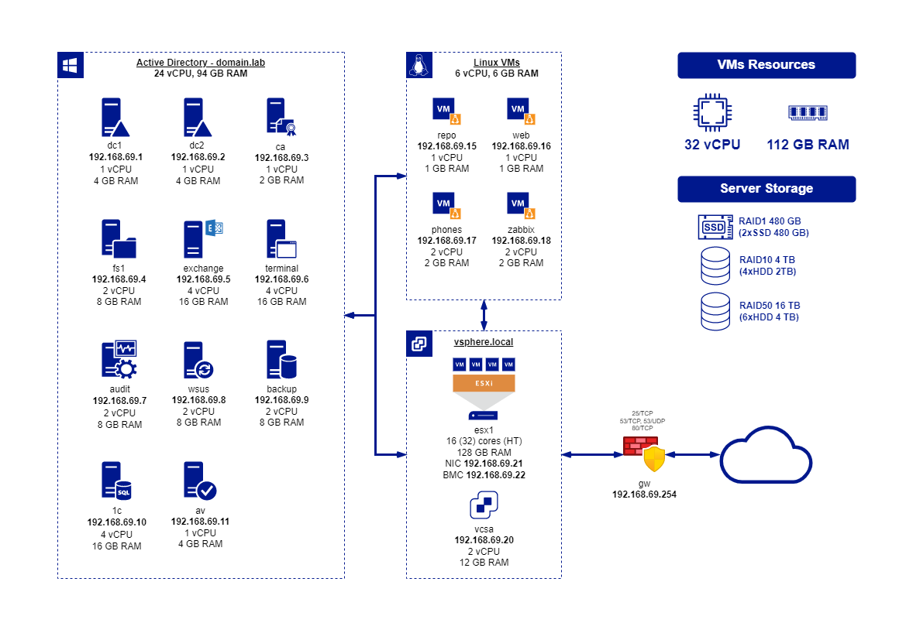

# domain.lab

Приведен пример создания локальной вычислительной сети небольшой организации на базе **Microsoft Active Directory** и **VMware vSphere 7**

## Описание
- сеть `192.168.69.0/24`
- домен Active Directory `domain.lab`
- Windows серверы `Windows Server 2022`
- Linux серверы `Debian 11`



## Полезные ссылки

### Windows
- [Информация о выпусках Windows 10](https://learn.microsoft.com/en-us/windows/release-health/release-information)
- [История обновлений Windows 10](https://support.microsoft.com/en-us/topic/windows-10-update-history-857b8ccb-71e4-49e5-b3f6-7073197d98fb)
- [Информация о выпусках Windows 11](https://learn.microsoft.com/en-us/windows/release-health/windows11-release-information)
- [История обновлений Windows 11](https://support.microsoft.com/en-us/topic/windows-11-version-22h2-update-history-ec4229c3-9c5f-4e75-9d6d-9025ab70fcce)

### Windows Server
- [Документация на Windows Server](https://learn.microsoft.com/en-us/windows-server)
- [Информация о выпусках Windows Server](https://learn.microsoft.com/en-us/windows-server/get-started/windows-server-release-info)
- [История обновлений Windows Server 2022](https://support.microsoft.com/en-gb/topic/windows-server-2022-update-history-e1caa597-00c5-4ab9-9f3e-8212fe80b2ee)
- [История обновлений Windows Server 2019](https://support.microsoft.com/en-us/topic/windows-10-and-windows-server-2019-update-history-725fc2e1-4443-6831-a5ca-51ff5cbcb059)
- [История обновлений Windows Server 2016](https://support.microsoft.com/en-us/topic/windows-10-and-windows-server-2016-update-history-4acfbc84-a290-1b54-536a-1c0430e9f3fd)
- [Windows Admin Center](https://learn.microsoft.com/en-us/windows-server/manage/windows-admin-center/overview)

### GPO
- [Административные шаблоны Windows](https://learn.microsoft.com/en-US/troubleshoot/windows-client/group-policy/create-and-manage-central-store)
- [Рекомендуемые Microsoft базовые GPO](https://techcommunity.microsoft.com/t5/microsoft-security-baselines/bg-p/Microsoft-Security-Baselines)

### WSUS
- [Каталог Центра обновления Microsoft](https://www.catalog.update.microsoft.com/home.aspx)
- [Обслуживание базы данных WSUS](https://learn.microsoft.com/en-GB/troubleshoot/mem/configmgr/update-management/wsus-maintenance-guide)

### Exchange Server
- [Документация на Microsoft Exchange Server](https://learn.microsoft.com/en-us/exchange/exchange-server?view=exchserver-2019)
- [Выпуски Microsoft Exchange Server](https://msexchangeupdates.com)

### SQL Server
- [Документация на Microsoft SQL Server](https://learn.microsoft.com/en-us/sql/sql-server/?view=sql-server-ver15)
- [Выпуски Microsoft SQL Server](https://sqlserverbuilds.blogspot.com)
- [Microsoft SQL Server 2019 Reporting Services](https://www.microsoft.com/ru-RU/download/details.aspx?id=100122)
- [SQL Server Management Studio](https://learn.microsoft.com/en-us/sql/ssms/download-sql-server-management-studio-ssms?view=sql-server-ver16)

### Zabbix
- [Загрузка и установка Zabbix](https://www.zabbix.com/download)
- [Документация Zabbix](https://www.zabbix.com/documentation/current/en/manual)

### Proxmox
- [Установка Proxmox VE на Debian 11 Bullseye](https://pve.proxmox.com/wiki/Install_Proxmox_VE_on_Debian_11_Bullseye)
- [Документация Proxmox Backup](https://pbs.proxmox.com/docs/)

## Разное

**Сводка безопасности [MS14-025](https://support.microsoft.com/en-us/topic/ms14-025-vulnerability-in-group-policy-preferences-could-allow-elevation-of-privilege-may-13-2014-60734e15-af79-26ca-ea53-8cd617073c30)**. С 2014 года GPO не содержат паролей (удален аттрибут CPassword), которые ранее использовались к примеру для установки пароля локального администратора. Рекомендуется использовать [Local admin password solution](https://www.microsoft.com/en-us/download/details.aspx?id=46899).

**Сводка безопасности [MS16-072](https://support.microsoft.com/en-us/topic/ms16-072-security-update-for-group-policy-june-14-2016-7570425d-d460-3003-b2ac-a464c874725d)**. Для GPO необходимо добавлять разрешение группе *Прошедшие проверку* или *Компьютеры домена* на *Чтение*, т.к. чтение групповых политик осуществляется в контексте компьютера, а не пользователя.

**Сводка безопасности [MS17-010](https://support.microsoft.com/en-us/topic/ms17-010-security-update-for-windows-smb-server-march-14-2017-435c22fb-5f9b-f0b3-3c4b-b605f4e6a655)**. Начиная с Windows 10 версии 1709 по-умолчанию отключен протокол SMBv1, что отключает Просмотр сетевого окружения и работу с Windows Server 2003.
Однако, если вам все еще нужно использовать сетевой проводник для поиска компьютеров Windows, можно выполнить эти шаги на компьютерах Windows, которые больше не используют протокол SMBv1:
1. Запустите службы "Хост поставщика службы обнаружения" (Function Discovery Provider Host, fdPHost) и "Публикация ресурсов обнаружения функции" (Function Discovery Resource Publication, FDResPub), затем задайте для них параметр "Автоматически (отложенный запуск)."
2. При открытии сетевого окружения включите обнаружение сети после соответствующего запроса.

**[Удаленный диспетчер устройств](https://learn.microsoft.com/en-US/troubleshoot/windows-server/system-management-components/error-connect-device-manager-remotely)**. Начиная с Windows 8 отключена поддержка удаленного доступа к PnP из соображений безопасности (нельзя подключиться к диспетчеру устройств)

**[Баг с WSUS и Windows 10 LTSB 2016](https://social.technet.microsoft.com/Forums/windowsserver/en-US/5521e7f1-fa2d-4867-a47c-b276c66e6a82/windows-10-anniversary-update-1607)**. Windows 10 1607 до билда 14393.222 (September 29, 2016 — KB3194496) не обновляется с WSUS сервера, необходима установка накопительного обновления и обновления стека обслуживания вручную, например:
```
dism.exe /online /add-package /packagepath:"C:\Temp\Windows10-KB3194496-x64.cab" /quiet /norestart /logpath:"C:\Logs\KB3194496.log"
```

**[Ошибка подключения по RDP к серверу без обновлений после 2018 г.](https://winitpro.ru/index.php/2018/05/11/rdp-auth-oshibka-credssp-encryption-oracle-remediation)** После установки обновлений безопасности Windows, которые вышли после мая 2018 года, вы можете столкнуться с ошибкой **CredSSP encryption oracle remediation** при RDP подключении к удаленному серверу и компьютеру Windows. Разрешить **на клиенте** подключаться на серверы без обновлений через **`gpedit.msc`**: ``Конфигурация компьютера -> Административные шаблоны -> Система -> Передача учетных данных -> Исправление уязвимости шифрующего оракула -> Оставить уязвимость``.