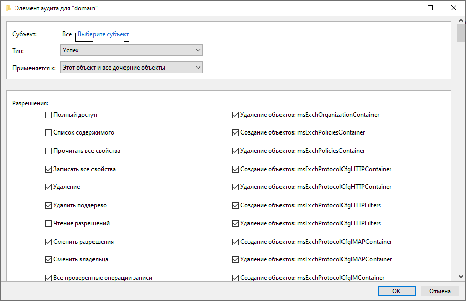
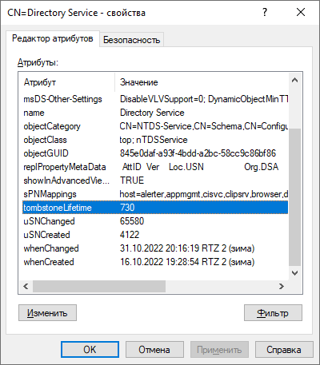

# Настройка audit

## Базовые настройки после установки операционной системы

Установка сетевых параметров, имени компьютера, включение в домен

```powershell
New-NetIPAddress -InterfaceAlias "Ethernet0" -IPAddress 192.168.69.7 -PrefixLength 24 -DefaultGateway 192.168.69.254
Set-DnsClientServerAddress -InterfaceAlias "Ethernet0" -ServerAddresses ("192.168.69.1","192.168.69.2")
New-ItemProperty "HKLM:\SYSTEM\CurrentControlSet\Services\Tcpip6\Parameters\" -Name "DisabledComponents" -Value 0xffffffff -PropertyType "DWord"
slmgr.vbs -ipk VDYBN-27WPP-V4HQT-9VMD4-VMK7H
Add-Computer -NewName "AUDIT" -DomainName "domain.lab" -OUPath "OU=Domain Servers,DC=domain,DC=lab" -Credential "Администратор@domain.lab" -Restart -Force
```

## Предварительные требования

- Устанавливаем `SQL Server 2019` (в компонентах выбираем **Службы ядра СУБД** и **Соединения с клиентскими средствами**, базу данных размещаем на диске **D:**)
- Устанавливаем `SQL Server 2019 Reporting Services`
- Устанавливаем `SQL Server Management Studio`

## Настройка инфрастуктуры для аудита

#### Настройка Active Directory

1. Настройка аудита для **раздела `domain.lab`**.
   - Открываем **`Пользователи и компьютеры`** > **`domain.lab`** > `Свойства` > `Безопасность` > **`Аудит`** 
   - Добавляем **`Все, Успех, Этот объект и все дочерние объекты`** > ставим `Полный доступ`, автоматически отмечаются все пункты > затем убираем 4 пункта: `Полный доступ, Список содержимого, Прочитать все свойства, Чтение разрешений` 
   - Листаем вниз и смотрим чтобы **не был** отмечен пункт `Применять эти параметры аудита к объектам и контейнерам только внутри этого контейнера`.



2. Настройка аудита для раздела домена **"Конфигурация"**.
   - Открываем **`Редактирование ADSI`** > `Подключение к...` > **`Конфигурация`** > **`CN=Configuration,DC=domain,DC=lab`** > `Свойства` > `Безопасность` > **`Аудит`** 
   - Добавляем **`Все, Успех, Этот объект и все дочерние объекты`** > ставим `Полный доступ` > убираем `Полный доступ, Список содержимого, Прочитать все свойства, Чтение разрешений` 
   - Листаем вниз и смотрим чтобы **не был** отмечен пункт `Применять эти параметры аудита к объектам и контейнерам только внутри этого контейнера`.

3. Настройка аудита для раздела домена **"Схема"**.
   - Открываем **`Редактирование ADSI`** > `Подключение к...` > **`Схема`** > **`CN=Schema,CN=Configuration,DC=domain,DC=lab`** > `Свойства` > `Безопасность` > **`Аудит`** 
   - Добавляем **`Все, Успех, Этот объект и все дочерние объекты`** > ставим `Полный доступ` > убираем `Полный доступ, Список содержимого, Прочитать все свойства, Чтение разрешений` 
   - Листаем вниз и смотрим чтобы **не был** отмечен пункт `Применять эти параметры аудита к объектам и контейнерам только внутри этого контейнера`.

4. **Настройка "Active Directory Tombstone Lifetime"**.<br>
   - Открываем **`Редактирование ADSI`** > `Подключение к...` > **`Конфигурация`** > `CN=Configuration,DC=domain,DC=lab` > `CN=Services` > `CN=Windows NT` > **`CN=Directory Service`** > `Свойства` 
   - Устанавливаем **`tombstoneLifetime = 730`**.<br>
   

5. На сервере `audit` запускаем службу **`Вторичный вход в систему`** и ставим `Автоматически`.

#### Настройка Exchange

1. **Настройка Administrator Audit Logging (AAL)**.<br>
   - В командной строке Exchange запускаем команду **`Set-AdminAuditLogConfig -AdminAuditLogEnabled $true -AdminAuditLogAgeLimit 30 -AdminAuditLogCmdlets * -LogLevel Verbose`**.
   - На сервере `audit` переходим в папке где установлен Netwrix находим скрипт `Active Directory Auditing\SetAALExcludedCmdlets.ps1` и копируем его на сервер `exchange`.
   - На сервере `exchange` запускаем скрипт **`.\SetAALExcludedCmdlets.ps1`**. Указанный файл содержит список командлетов, исключаемых из логирования.
2. **Настройка мониторинга `Доступ к почтовым ящикам`**.<br>

   На сервере `exchange` запускаем команду:

```powershell
Get-MailboxDatabase -Server "exchange.domain.lab" | foreach { 
  Get-Mailbox -RecipientTypeDetails UserMailbox,SharedMailbox,EquipmentMailbox,LinkedMailbox,RoomMailbox | `
  Set-Mailbox -AuditEnabled $true -AuditAdmin Update,Copy,Move,MoveToDeletedItems,SoftDelete,HardDelete,FolderBind,SendAs,SendOnBehalf,MessageBind,Create -AuditDelegate Update,Move,MoveToDeletedItems,SoftDelete,HardDelete,FolderBind,SendAs,SendOnBehalf,Create 
}
```

#### Настройка Windows File Servers

1. Применить ранее созданную GPO `Audit - Настройки FS для Netwrix` для файлового сервера.
2. Включить символьные ссылки на сервере `audit`. Для этого запускаем в командной строке **`fsutil behavior set SymlinkEvaluation R2R:1 R2L:1`**

#### Настройка Logon Activity

Netwrix сам включит на **контроллерах домена** следующие правила для Удаленного управление журналом событий.

```powershell
# Проверка состояния
Get-NetFirewallRule RemoteEventLogSvc-In-TCP,RemoteEventLogSvc-NP-In-TCP,RemoteEventLogSvc-RPCSS-In-TCP | Format-Table
# Включение правила
Set-NetFirewallRule RemoteEventLogSvc-In-TCP,RemoteEventLogSvc-NP-In-TCP,RemoteEventLogSvc-RPCSS-In-TCP -Enabled True
```